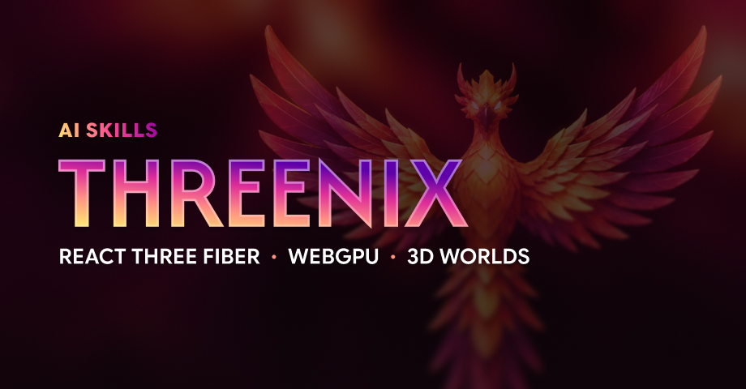

[](https://threenix.io)

[Explore the demo](https://threenix.io)

# Skills for Advanced React Three Fiber + WebGPU Developers

[](https://skills.sh/prag-matt-ic/threenix-plugin)

Build WebGPU scenes and improve existing Three.js code with focused AI skills from Threenix, a Three.js development studio. Includes R3F v10 scene components, GPU particle effects, and reviews for performance and TSL shaders.

_Currently in Alpha._

## Why Threenix

React Three Fiber v10 and Three.js Shading Language (TSL) are still evolving. Reliable patterns can be hard to find online, and performance best practices are easy to miss. These skills were developed alongside real 3D projects where they have proven measurable impact.

## Installation

### Skills CLI

Run this from your project directory to install Threenix skills:

```bash
npx skills add prag-matt-ic/threenix-plugin
```

Follow the prompts to choose your skills and agents. For Cursor-specific guidance, see Cursor's [Skills guide](https://cursor.com/help/customization/skills).

<details>
<summary><strong>ChatGPT / Codex</strong></summary>

```bash
codex plugin marketplace add prag-matt-ic/threenix-plugin
codex plugin add threenix@threenix
```

</details>

<details>
<summary><strong>Claude Code</strong></summary>

```bash
claude plugin marketplace add prag-matt-ic/threenix-plugin
claude plugin install threenix@threenix
```

</details>

## Start here

- **Review an existing scene:** [`best-practices`](skills/best-practices/SKILL.md)
- **Start a WebGPU scene:** [`add-webgpu-canvas`](skills/add-webgpu-canvas/SKILL.md)
- **Add a visual effect:** [`add-fireworks`](skills/add-fireworks/SKILL.md)

## Skills

Start a new task or session after installing. For focused reviews, `@`-mention the chosen files as context.

Invoke a skill by name: `$best-practices` in Codex, `/best-practices` in Cursor or Claude Code when installed through the Skills CLI, or `/threenix:best-practices` with the Claude Code plugin.

### Review / Refactor

Catch performance problems, remove unnecessary complexity, and make Three.js, R3F, and TSL code easier to maintain.

| Skill                                              | What it does                                                                          |
| -------------------------------------------------- | ------------------------------------------------------------------------------------- |
| [`best-practices`](skills/best-practices/SKILL.md) | Review and refactor Three.js and R3F code for performance and clarity.                |
| [`clean-code`](skills/clean-code/SKILL.md)         | Review and refactor Typescript code against a Clean Code checklist.                   |
| [`optimize-tsl`](skills/optimize-tsl/SKILL.md)     | Optimize Three.js Shading Language (TSL) nodes without changing their visible output. |
| [`simplify`](skills/simplify/SKILL.md)             | Review the latest commit for duplication and unnecessary complexity.                  |

### Add Components

Ship WebGPU features faster by adding proven scene foundations and effects to an existing project.

| Skill                                                                                      | What it does                                                      |
| ------------------------------------------------------------------------------------------ | ----------------------------------------------------------------- |
| [`add-background-node`](skills/add-background-node/SKILL.md)                               | Add a custom TSL background to an existing WebGPU R3F canvas.     |
| [`add-camera-controls`](skills/add-camera-controls/SKILL.md)                               | Add cinematic camera controls to an existing R3F scene.           |
| [`add-fast-text`](skills/add-fast-text/SKILL.md)                                           | Add fast canvas-backed text to an existing WebGPU R3F scene.      |
| [`add-fireworks`](skills/add-fireworks/SKILL.md)                                           | Add GPU compute fireworks to an existing WebGPU R3F scene.        |
| [`add-linked-particles`](skills/add-linked-particles/SKILL.md)                             | Add GPU proximity-linked particles to an existing WebGPU scene.   |
| [`add-mesh-surface-sampled-particles`](skills/add-mesh-surface-sampled-particles/SKILL.md) | Add a mesh-sampled Phoenix particle silhouette to a WebGPU scene. |
| [`add-webgpu-canvas`](skills/add-webgpu-canvas/SKILL.md)                                   | Create a WebGPU R3F canvas from the bundled Threenix reference.   |
