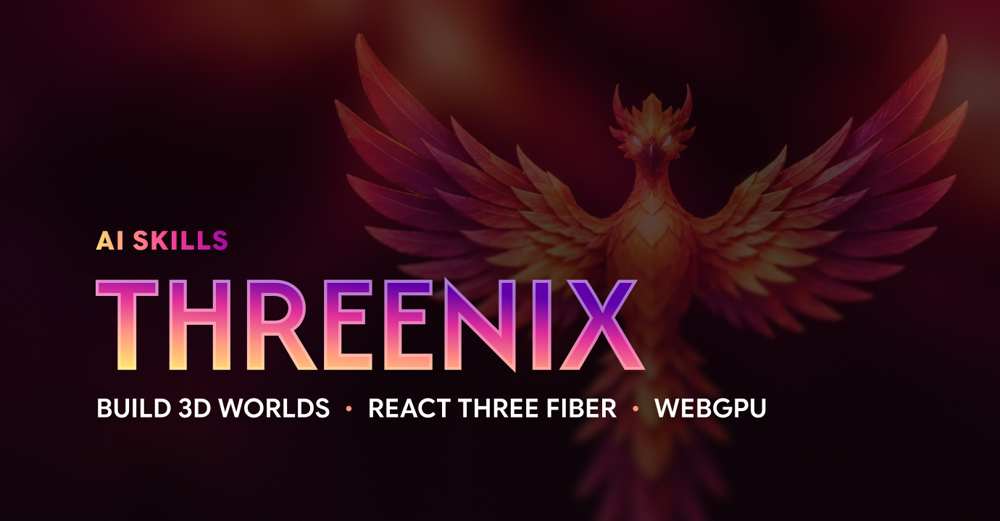

[](https://threenix.io)

[Explore the demo](https://threenix.io)

# Skills for Advanced React Three Fiber + WebGPU Developers

[](https://skills.sh/prag-matt-ic/threenix-plugin)

Build WebGPU scenes and improve existing Three.js code with focused AI skills from Threenix, a Three.js development studio. Includes R3F v10 scene components, GPU particle effects, and reviews for performance and TSL shaders.

_Currently in Alpha._

## Why Threenix

React Three Fiber v10 and Three.js Shading Language (TSL) are still evolving. Reliable patterns can be hard to find online, and performance best practices are easy to miss. These skills were developed alongside real 3D projects where they have proven measurable impact.

## Installation

### Skills CLI

Run this from your project directory to install Threenix skills:

```bash
npx skills add prag-matt-ic/threenix-plugin
```

Follow the prompts to choose your skills and agents. For Cursor-specific guidance, see Cursor's [Skills guide](https://cursor.com/help/customization/skills).

<details>
<summary><strong>ChatGPT / Codex</strong></summary>

```bash
codex plugin marketplace add prag-matt-ic/threenix-plugin
codex plugin add threenix@threenix
```

</details>

<details>
<summary><strong>Claude Code</strong></summary>

```bash
claude plugin marketplace add prag-matt-ic/threenix-plugin
claude plugin install threenix@threenix
```

</details>

## Startup updates

From `0.8.0`, Codex and Claude marketplace installations include a `SessionStart`
hook. On startup or resume, it compares the loaded plugin's version with the
stable `major.minor.patch` version in this repository's public `main` manifest.
When a newer release exists, it refreshes the `threenix` marketplace and updates
`threenix@threenix` through the host's plugin manager. This updates the whole
plugin, including its skills. It does not run before each tool or after compaction.

The hook requires **Node 20+**, Git, and the corresponding `codex` or `claude` CLI
on the hook process's `PATH`. The updater was tested with Codex CLI `0.160.0`
and Claude Code `2.1.289` on macOS. Older CLIs with different metadata or command
support fail open; native Windows host integration has not been verified.

Current installations stay quiet. After a confirmed update, Claude users can
run `/reload-plugins` or start a new session; Codex users should start a new
session and restart the app if it still loads the previous version. Files already
loaded into a running session are not replaced in the model's context.

The updater allows at most 30 seconds for input, network access, subprocesses,
and cleanup. Offline checks, missing CLIs, and update failures print a brief
diagnostic and let work continue. Concurrent sessions share a per-host/profile
lock in the operating system's temporary directory; abandoned locks are recovered.
The script never edits the host's plugin cache or installation records directly.

Only an enabled installation from the unpinned public
`prag-matt-ic/threenix-plugin` marketplace is eligible. Pinned sources (including
explicit refs), local development copies, managed Claude installs, unrelated
marketplaces, prereleases, and invalid versions are skipped. Claude retains the
scope of the loaded installation. Skills installed using `npx skills add`, Cursor,
and Copilot are outside this updater's supported installation routes.

### Hook trust and activation

Codex requires you to review and trust the hook before it runs; installing the
plugin alone does not grant that trust. Updates can require a fresh review. The
plugin never bypasses this control. See [OpenAI's bundled-hook documentation](https://developers.openai.com/plugins/build/plugins#bundled-mcp-servers-and-lifecycle-hooks).

Claude also offers native marketplace auto-updates: `/plugin` → Marketplaces →
`threenix` → Enable auto-update. The hook checks host installation metadata to
avoid reinstalling a release already downloaded by another session or the host.
See [Claude's update documentation](https://code.claude.com/docs/en/discover-plugins#keep-plugins-updated).

Existing users need **one manual update** to receive the hook:

```bash
# Codex
codex plugin marketplace upgrade threenix
codex plugin add threenix@threenix

# Claude Code
claude plugin marketplace update threenix
claude plugin update threenix@threenix
```

On Claude Code older than `2.1.281`, supply `--scope project` or `--scope local`
for a non-user installation. Start a new session after this initial update and
complete any host hook-trust review.

### Releasing updates

Keep `plugin.json`, `.codex-plugin/plugin.json`, and `.claude-plugin/plugin.json`
at the same stable version. Bump that version whenever publishing changed skills
or hooks: same-version edits do not trigger this updater. From the private
monorepo, publish the plugin subtree with `npm run release:plugin`. The public
`main` branch is the release channel; GitHub release tags are not consulted.

The shared `hooks/hooks.json` is discovered by both hosts, with
`CLAUDE_PLUGIN_ROOT` supplied by Claude and as a compatibility variable by Codex.
Hooks are host-specific, not a portable component of the
[Agent Plugins specification](https://agent-plugins.org/specification).
Run the focused regression suite from the monorepo root:

```bash
npm test -- scripts/plugin-updates.test.mjs
```

## Start here

- **Review an existing scene:** [`best-practices`](skills/best-practices/SKILL.md)
- **Start a WebGPU scene:** [`add-webgpu-canvas`](skills/add-webgpu-canvas/SKILL.md)
- **Use R3F v10 hooks:** [`r3f-v10-webgpu-hooks`](skills/r3f-v10-webgpu-hooks/SKILL.md)
- **Add a visual effect:** [`add-fireworks`](skills/add-fireworks/SKILL.md)

## Skills

Start a new task or session after installing. For focused reviews, `@`-mention the chosen files as context.

Invoke a skill by name: `$best-practices` in Codex, `/best-practices` in Cursor or Claude Code when installed through the Skills CLI, or `/threenix:best-practices` with the Claude Code plugin.

### Review / Refactor

Catch performance problems, remove unnecessary complexity, and make Three.js, R3F, and TSL code easier to maintain.

| Skill                                                          | What it does                                                                                 |
| -------------------------------------------------------------- | -------------------------------------------------------------------------------------------- |
| [`best-practices`](skills/best-practices/SKILL.md)             | Review and refactor Three.js and R3F code for performance and clarity.                       |
| [`benchmark-webgpu`](skills/benchmark-webgpu/SKILL.md)         | Measure Three.js WebGPU render and compute workloads with GPU timestamps.                    |
| [`clean-code`](skills/clean-code/SKILL.md)                     | Review and refactor Typescript code against a Clean Code checklist.                          |
| [`optimize-tsl`](skills/optimize-tsl/SKILL.md)                 | Optimize Three.js Shading Language (TSL) nodes without changing their visible output.        |
| [`r3f-v10-webgpu-hooks`](skills/r3f-v10-webgpu-hooks/SKILL.md) | Choose WebGPU hooks and manage uniforms, graphs, buffers, textures, and pipeline lifecycles. |

For standalone baselines or before/after GPU comparisons, use [`benchmark-webgpu`](skills/benchmark-webgpu/SKILL.md) and its [Node benchmark guide](skills/benchmark-webgpu/BENCHMARK.md). `optimize-tsl` uses it when a shader change needs measurement.

### Add Components

Ship WebGPU features faster by adding proven scene foundations and effects to an existing project.

| Skill                                                                                      | What it does                                                      |
| ------------------------------------------------------------------------------------------ | ----------------------------------------------------------------- |
| [`add-background-node`](skills/add-background-node/SKILL.md)                               | Add a custom TSL background to an existing WebGPU R3F canvas.     |
| [`add-camera-controls`](skills/add-camera-controls/SKILL.md)                               | Add cinematic camera controls to an existing R3F scene.           |
| [`add-fast-text`](skills/add-fast-text/SKILL.md)                                           | Add fast canvas-backed text to an existing WebGPU R3F scene.      |
| [`add-fireworks`](skills/add-fireworks/SKILL.md)                                           | Add GPU compute fireworks to an existing WebGPU R3F scene.        |
| [`add-linked-particles`](skills/add-linked-particles/SKILL.md)                             | Add GPU proximity-linked particles to an existing WebGPU scene.   |
| [`add-mesh-surface-sampled-particles`](skills/add-mesh-surface-sampled-particles/SKILL.md) | Add a mesh-sampled Phoenix particle silhouette to a WebGPU scene. |
| [`add-scene-warmup`](skills/add-scene-warmup/SKILL.md)                                     | Reduce first-reveal stutter with or without postprocessing.       |
| [`add-webgpu-canvas`](skills/add-webgpu-canvas/SKILL.md)                                   | Create a WebGPU R3F canvas from the bundled Threenix reference.   |
